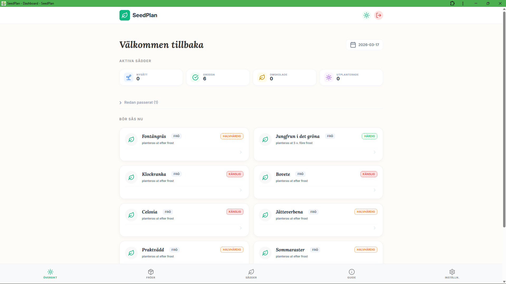
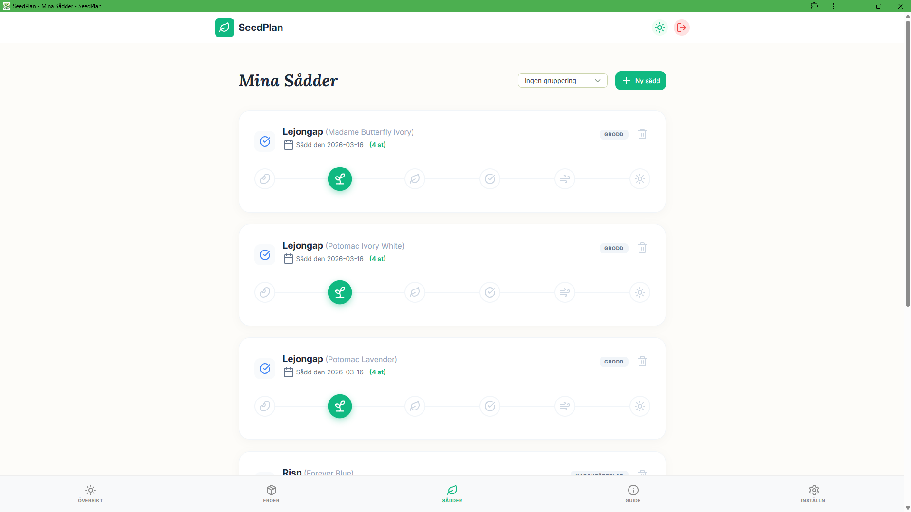

# SeedPlan 🌱

SeedPlan är en PWA för att hantera fröinventering, planera sådder utifrån sista frostdatum och följa såddars utveckling. Appen är byggd med Blazor WebAssembly och Supabase, med svensk UI och mobil-först-design.

README:n speglar nu riktningen i [SPEC.md](SPEC.md) (v2.0, mars 2026).

## Nuvarande fokus

- Förbättra kontoinställningar och settings-flöde.
- Utöka rekommendationer på startsidan med användarstyrt kategorifilter.
- Fortsätta bygga ut fröinventarie, sålogik och statistik i prioriterad ordning.

## Status just nu

- ✅ Basflöden finns: auth, dashboard, fröinventarie, såddhantering, växtguide, PWA-stöd.
- ✅ Push-infrastruktur för orörda såddar finns (inklusive Edge Function för manuell trigger).
- ✅ Kontoinställningar pågår: e-post/lösenord finns, men validering och UX-justeringar återstår.
- 🟡 Notiser i UI är delvis klara: global toggle finns, men utökad konfiguration saknas.
- ✅ Nästa större steg: settings-omstrukturering (frostdatum+zon ihop) och kategori-filter för startsidans förslag.
- 🔨 Framtida fas: kontoradering och JSON-backup/export.

## Funktioner i appen (idag)

- Dashboard med rekommenderade arter att så, aktiva såddar och varningar.
- Fröinventarie med lagerhantering och koppling till växtdatabas.
- Såddhantering med statusflöde och översikter.
- Växtguide baserad på `plants`-data.
- Supabase Auth (e-post/lösenord) och profilsida.
- Push-notiser för orörda såddar (grundinfrastruktur + Edge Function finns).
- PWA-stöd: installerbar app, responsiv mobilvy och grundläggande offline-stöd.

## Uppdaterade produktbeslut (v2)

- Kontoinställningar i `/profile` fokuserar på e-post och lösenord.
- Odlingszon tas bort från kontoinställningar i `/profile`.
- Frostdatum och odlingszon hanteras tillsammans i `/settings` (samma knapp/modal).
- Startsidans förslag ska kunna filtreras av användaren per växtkategori (`PlantCategory`):
	- `Vegetable`
	- `Flower`
	- `Herb`
	- `Fruit`
- Radera konto och exportera data är flyttat till framtida fas (ingår ej i v2).

## Teknisk stack

- Frontend: Blazor WebAssembly (.NET 8)
- Backend/API: Blazor + Supabase
- Databas & Auth: Supabase (PostgreSQL + GoTrue)
- Deployment: Docker + Railway

## Prioriterad roadmap (enligt SPEC)

1. Kontofunktioner: färdigställa e-post/lösenordsflöden
2. Profil & inställningsstruktur:
	 - slå ihop frostdatum + zon i `/settings`
	 - ta bort zon från kontoinställningar i `/profile`
	 - lägga till kategorival för startsidans förslag
3. Utökat fröinventarie
4. Förbättrade såddrekommendationer
5. Utökad såddhantering
6. Statistik
7. Notiser (utökad konfiguration)

## Ingår ej i v2 (framtida fas)

- Radera konto
- Exportera data (JSON-backup)
- Import av backup-data
- Kalendervy
- Adaptiva rekommendationer
- Bildlogg per sådd
- Export till PDF/CSV
- Delning av data mellan användare
- Väderprognos-integration

## Bilder

